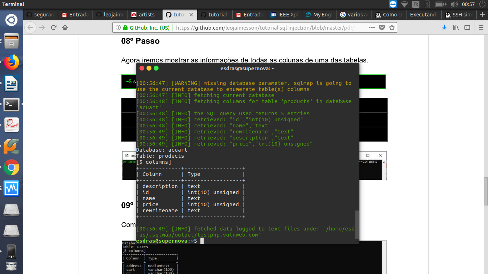
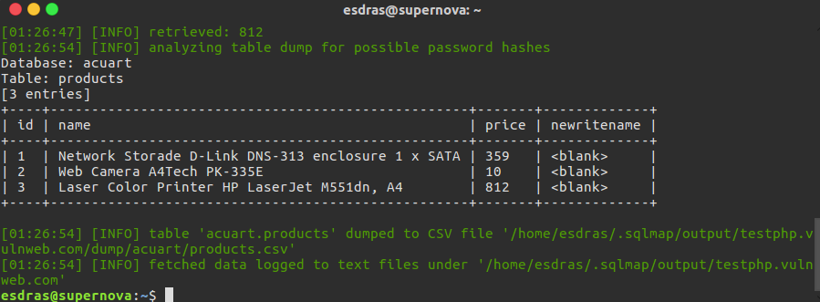

# SQL injection
Esdras Emanuel Mariano Moreira

Fiz os testes com o link que a dupla disponibilizou, primeiro tiver que instalar as ferramentas necessárias em seguida, descobrir o nome do banco:

Agora podemos ver as tabelas dessa base de dados:

Com as tabelas descobertas, agora podemos ver as colunas das mesmas:

Agora vamos podemos ver o conteudo das colunas que desejamos:

