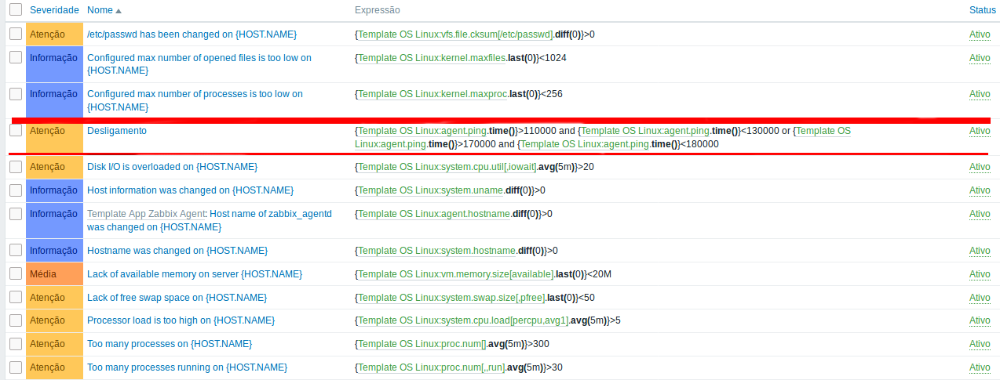
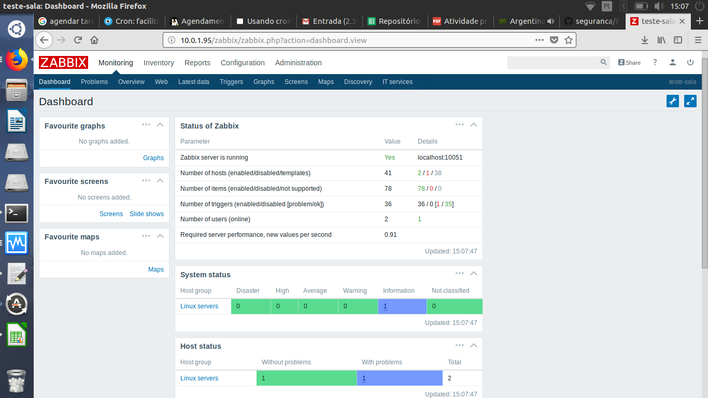
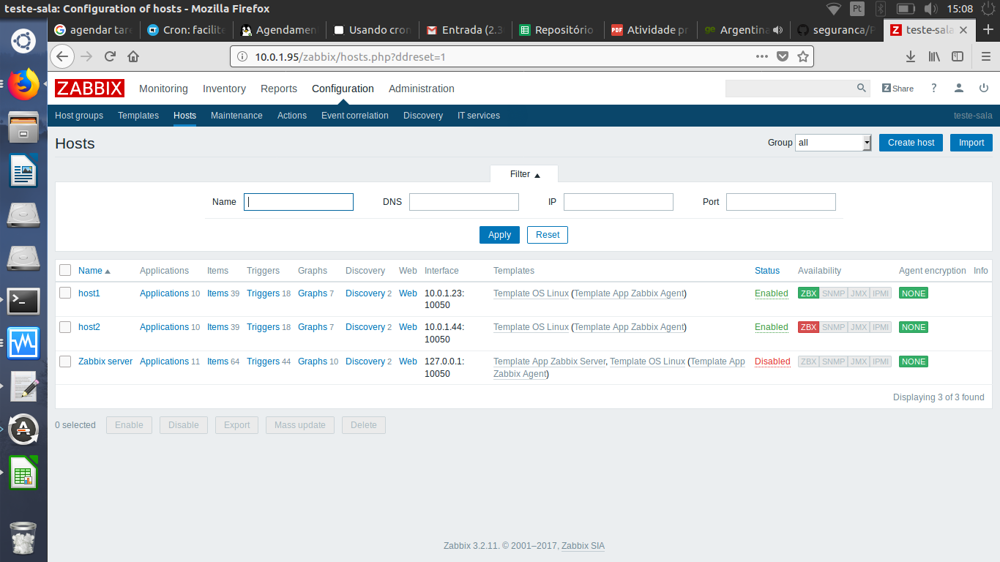
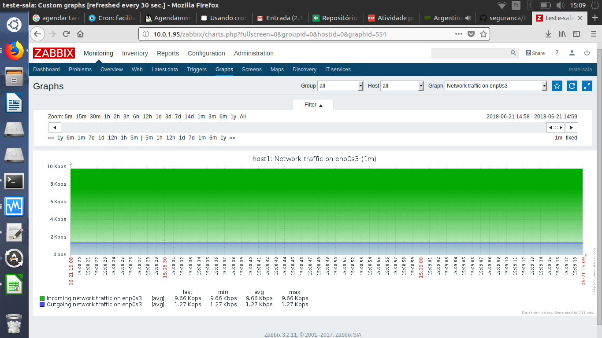

## ZABBIX

A Pratica com o Zabbix foi tranquila, ja conhecia a ferramenta e ja havia brincado com ums coisinha como por exempo: Criando Trigger, ações, alertas (via email) entre outras. para essa pratica instalei o zabbix servidor e dois agentes, fiz a monitorarização e crei uma trigger:

