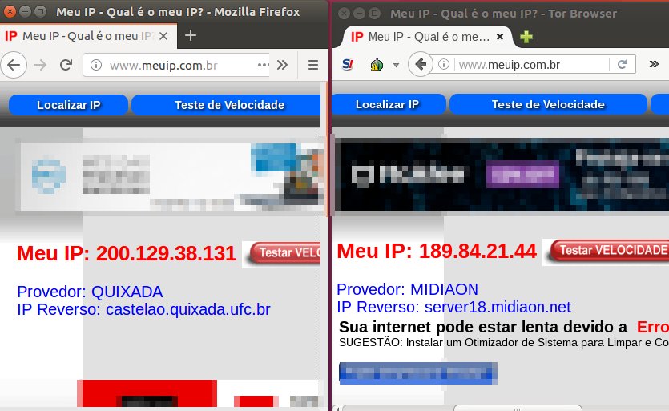
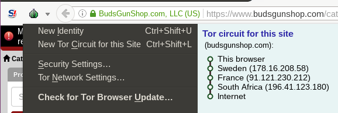

## Pratica TOR
Questões
1ª) Instalar o Tor no linux ou windows.  
2ª) Configurar uma lista negra de paises pelos quais não ache seguro passar.  
3ª) Acessar alguns sites que rastreiam seu ip para testar o anônimato do Tor.  
4ª) Acessar algum site da deep web e tirar uns prints da tela do site.  

