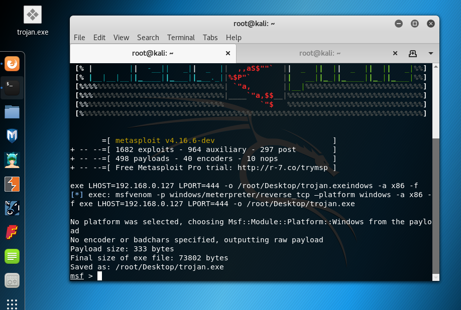
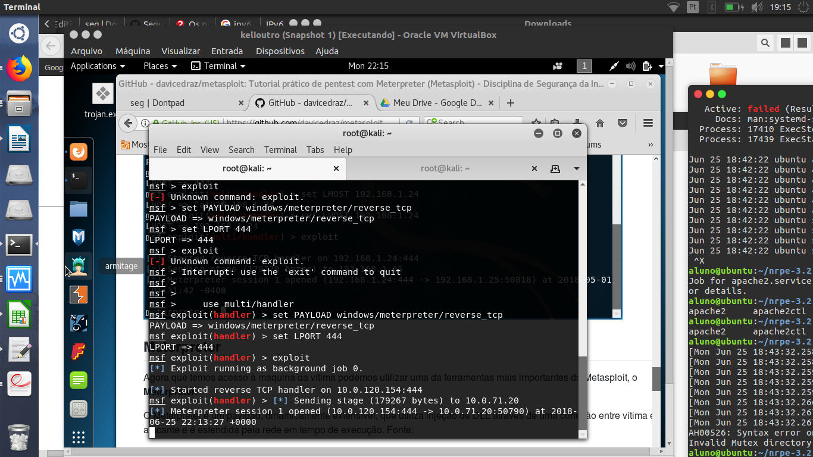

# Metasploit

Na Sala de aula eu acompanhei a pratica até a parte de criação do Trojan, porém nao teve como executa-lo em uma maquina Windows 10:

Depois fiz os teste e conseguir obter captura de telas da maquina atacada:

