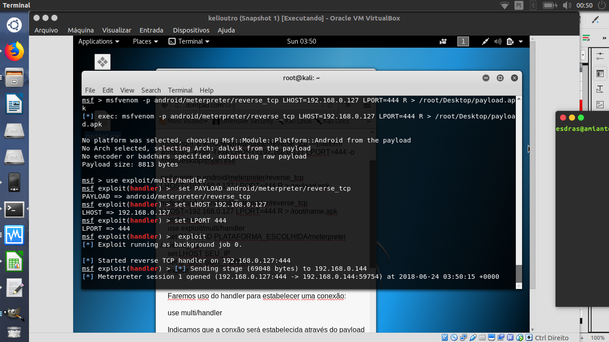
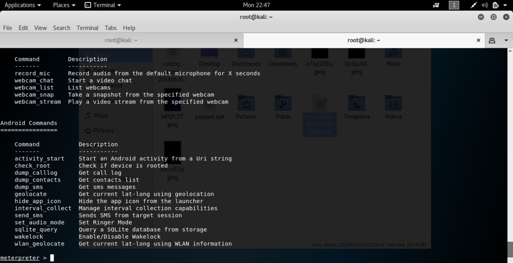
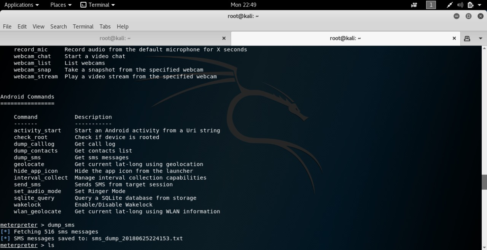
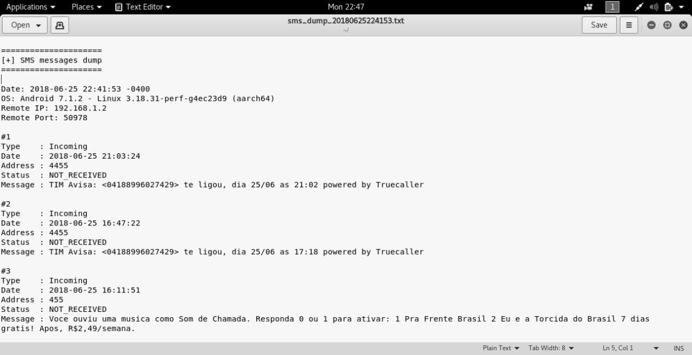

Backdoor

Foi gerado o APK e testado no celular da minha avó. fiz todos os passo conforme o tutorial, o meterpreter abriu conexão com o celular, porém o terminal do meterpreter não abriu(esperei mais de 20 minutos, depois fechei). 

- Tentei novamente outro dia, e deu certo, abriu a conexão e o terminal para inserir os comando:

- Para teste, usei o comando que salva em um arquivo de texto todos os SMS do celular da vitima:

- Arquivo  gerado: 

